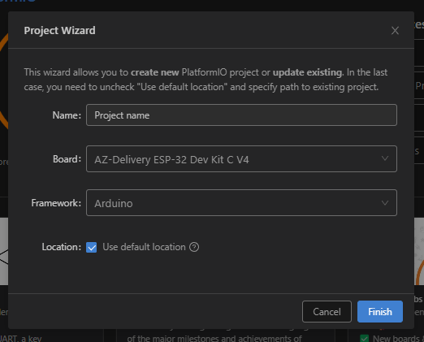

# Info sobre la placa (Az-Deliery)

- Compra: https://www.amazon.es/AZDelivery-NodeMCU-ESP-WROOM-32-Tablero-Desarrollo/dp/B071P98VTG/ref=sr_1_1_sspa

- Pinout (pdf): Ver directorio `pdf`

Esta placa no tiene builtin led. Usar pin G2 con resistencia en su lugar es seguro.

# Arduino

En el framework de arduino, esta placa en concreto no viene instalada. Para ello hay que eliminar las placas existentes de esp dentro del directorio de arduino, añadir el repositorio del fabricante e instalar la placa.

## Instalación (info del fabricante)

https://www.az-delivery.de/es/blogs/azdelivery-blog-fur-arduino-und-raspberry-pi/esp32-jetzt-mit-boardverwalter-installieren

Si el link no funciona, esta docu esta respaldada en el directorio de recursos pdf.

## Notas de instalación

1. Eliminar el directorio de ESP32 existente en el directorio de Arduino.

2. Desde el gestor de placas de arduino, añadir la url:
```
https://espressif.github.io/arduino-esp32/package_esp32_index.json
```
3. Buscar `esp32 by espressif systems` en la lista de instalación e instalar.

Tras estos pasos he hecho pruebas seleccionando la placa `ESP32-WROOM-DA Module` y todo parece funcionar correctamente. Si se encuentran problemas al flashear la placa, ver el apartado `Driver UART to USB`

# PlatformIO

## Docu oficial

 https://docs.platformio.org/en/latest/boards/espressif32/az-delivery-devkit-v4.html?utm_source=platformio&utm_medium=piohome

## Notas de instalación y uso

No estoy seguro de si es necesario añadir un repositorio en este caso. En cualquier caso no recuerdo haber añadido el repositorio. Es posible que se comparta el directorio de Arduino y al haberla instalado primero pudiese encontrarla.

El nombre exacto en la lista es `Espressif 32 > AZ-Delivery ESP-32 Dev kit C V4`



En cualquier caso el `platformio.ini` quedaría así:

```
[env:az-delivery-devkit-v4]
platform = espressif32
board = az-delivery-devkit-v4
framework = arduino
monitor_speed = 115200
```

## Driver UART to USB

Dentro del directorio resources en este repo hay uno de drivers. En cualquier caso, lo mejor es buscar el driver estable mas reciente en la web del fabricante. Los enlaces son los siguientes:

- CP210x https://www.silabs.com/developers/usb-to-uart-bridge-vcp-drivers?tab=downloads
- CH340x https://www.wch-ic.com/downloads/CH341SER_ZIP.html

A pesar de haber configurado la placa correctamente, es posible que haya problemas al quemar los programas en la placa. En mi caso ha sido necesario instalar el driver de puertos serie del fabricante de la placa.

Errores que he visto:

 - Error `ser_open()`
 - Errores de permisos
 - Error que dice algo sobre que el puerto es un puerto nativo

Tras instalar los drivers de UART estos errores desaparecieron.

Para este Dev kit C V4 el conversor es un `CP210x de silicon labs`. Los ZIP con los drivers están en el directorio resources.

También se añade el driver para el chip `CH340x`. No es necesario para esta placa, pero probablemente sea necesario para los Arduinos que tengo en casa.

# Otros recursos de interés

